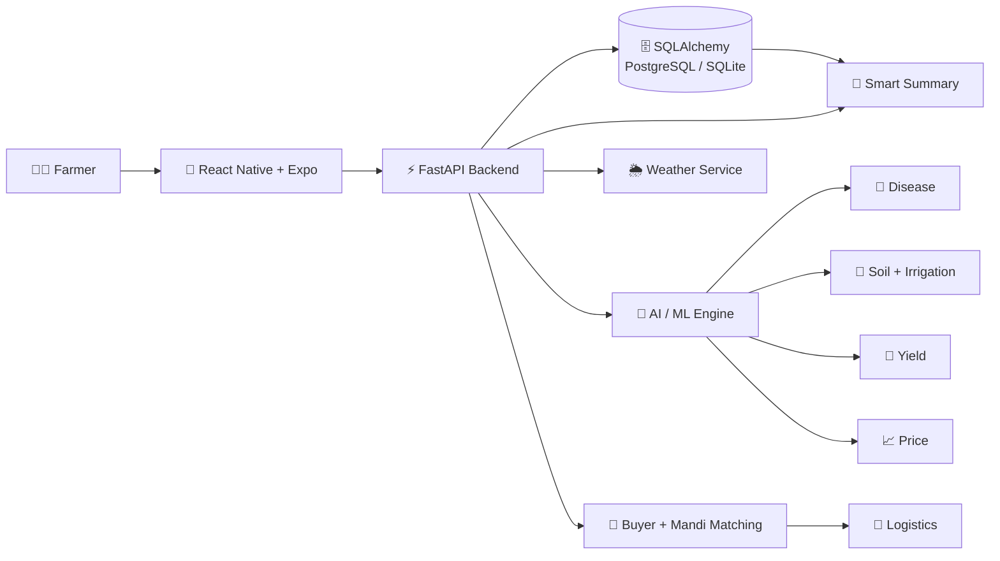
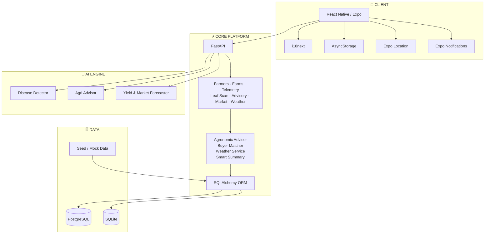
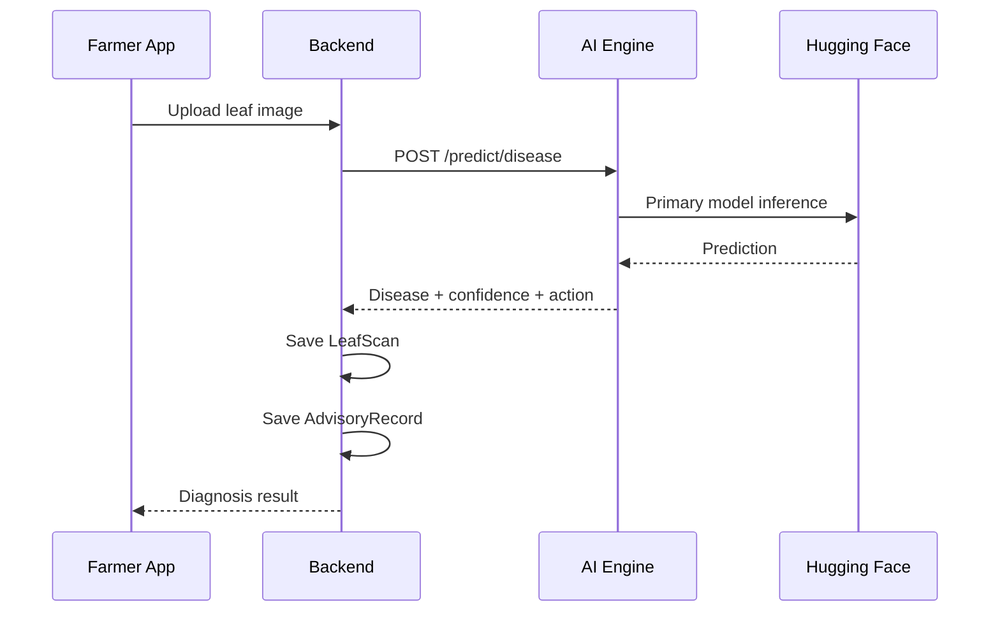
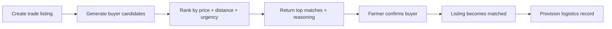
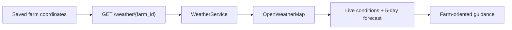

<div align="center">

<a href="https://github.com/Ankit-Tank/Krishi-Setu">
  
</a>


### 🌾 A farmer’s field should not have to guess.

**Krishi Setu** is a cloud-native agriculture platform connecting field data, crop health, weather, AI-assisted diagnosis, agronomic guidance, market intelligence, and buyer matching in one workflow.

<br/>


<br/>


<br/><br/>

> **Field → Intelligence → Advice → Market → Action**

<a href="#-why-krishi-setu">Why</a> · <a href="#-what-it-does">Capabilities</a> · <a href="#-how-it-works">How it works</a> · <a href="#-architecture">Architecture</a> · <a href="#-quick-start">Run it</a> · <a href="#-api-surface">API</a>

</div>

---

## 🌱 Why Krishi Setu?

Agricultural decisions are connected, but the information needed to make them is often fragmented.

| Signal | Decision |
|---|---|
| 🌿 Crop symptoms | What is affecting the plant? |
| 🧪 Soil + telemetry | Does it need water or nutrients? |
| 🌦️ Weather | What is likely to change next? |
| 📈 Market movement | When and where should the crop be sold? |
| 🤝 Buyer demand | Who should actually buy it? |
| 🚚 Logistics | How does the confirmed trade move? |

**Krishi Setu connects these signals into one decision-support loop.**

---

## ✨ What It Does

| Capability | What happens |
|---|---|
| 🔬 **Disease scanning** | Leaf image → AI inference → disease, confidence, action, persisted scan |
| 🧪 **Soil & irrigation** | N/P/K, pH, moisture, temperature and humidity → crop-aware advisory |
| 🌦️ **Live weather** | Farm coordinates → live conditions + 5-day forecast → farm guidance |
| 📈 **Yield + price** | Crop lifecycle + telemetry → harvest window/yield; historical mandi prices → 14-day forecast |
| 🤝 **Buyer matching** | Harvest listing → buyer/mandi candidates → ranked matches with reasons |
| 🚚 **Trade logistics** | Selected buyer → listing marked matched → logistics record provisioned |
| 🧠 **Smart summary** | Latest farm signals → one decision-oriented summary |
| 📱 **Mobile app** | Expo / React Native client with onboarding, auth, tabs, history, location, notifications, caching and i18n |

---

## 🔄 How It Works



GitHub supports Mermaid diagrams directly in Markdown, keeping architecture diagrams editable and version-controlled rather than embedding static screenshots.

---

## 🧭 The Decision Loop

```text
        ┌─────────────────────┐
        │      FARM STATE     │
        │ crop · soil ·       │
        │ weather · history   │
        └──────────┬──────────┘
                   │
                   ▼
        ┌─────────────────────┐
        │     INTELLIGENCE    │
        │ disease · advisory  │
        │ yield · market      │
        └──────────┬──────────┘
                   │
                   ▼
        ┌─────────────────────┐
        │   RECOMMENDATION    │
        │ what · when · where │
        └──────────┬──────────┘
                   │
                   ▼
        ┌─────────────────────┐
        │       ACTION        │
        │ trade · confirm ·   │
        │ logistics           │
        └─────────────────────┘
```

This is the project’s central idea:

> **Turn farm signals into an actionable next step.**

---

## 🏗️ Architecture



The monorepo separates the farmer-facing app, core API, AI service, data layer, documentation, and seed/demo data.

---

## 🔬 Disease Diagnosis Pipeline



The repository includes local disease-model assets and fallback inference paths, making the diagnosis service more resilient when an external inference dependency is unavailable.

---

## 🌾 Yield + Market Intelligence

### Yield

The current lifecycle model covers:

**Wheat · Rice/Paddy · Cotton · Soybean · Maize**

It derives:

- projected harvest start/end
- current growth stage
- estimated yield per acre
- reasoning based on crop lifecycle and available telemetry summary

### Market price

```text
Historical mandi prices
        │
        ▼
   14-day forecast
        │
        ▼
Projected peak price
        │
        ▼
Best selling window
```

The implementation attempts **Prophet** forecasting and falls back to local trend/seasonality logic if that path fails.

> Forecast output in this prototype should be treated as a software estimate, not a guaranteed market prediction.

---

## 🤝 Harvest → Buyer → Logistics



The matching flow considers:

**offered price + distance + demand urgency**

The confirmation endpoint then provisions logistics information including pickup date, transporter, and estimated transit duration.

---

## 🌦️ Weather



The weather router supports both farm-based weather lookup and direct latitude/longitude queries.

---

## 🛠️ Tech Stack

| Layer | Technology |
|---|---|
| Mobile | React Native, Expo, Expo Router |
| Language | TypeScript |
| Backend | Python, FastAPI, Uvicorn |
| ORM | SQLAlchemy |
| Database | PostgreSQL / SQLite |
| HTTP | httpx |
| AI / ML | PyTorch, TorchVision, Transformers, scikit-learn, Prophet |
| Vision | Pillow, NumPy, TFLite / LiteRT support |
| Weather | OpenWeatherMap |
| Localization | i18next / react-i18next |
| Device APIs | Expo Location, Image Picker, Notifications |
| Local storage | AsyncStorage |
| Infrastructure | Docker + Docker Compose |

---

## 🧩 Project Map

```text
Krishi-Setu/
├── README.md
├── SETUP.md
├── docker-compose.yml
├── agro_cloud.db
└── agro-cloud-platform/
    ├── backend/
    │   ├── app/
    │   │   ├── api/
    │   │   ├── core/
    │   │   ├── db/
    │   │   ├── models/
    │   │   ├── schemas/
    │   │   └── services/
    │   ├── seed.py
    │   ├── requirements.txt
    │   └── test_*.py
    │
    ├── ai-engine/
    │   ├── app/
    │   │   ├── core/
    │   │   ├── schemas/
    │   │   └── services/
    │   ├── models/
    │   ├── download_model.py
    │   ├── requirements.txt
    │   └── test_*.py
    │
    ├── mobile-app/
    │   ├── app/
    │   ├── assets/
    │   ├── src/
    │   └── package.json
    │
    ├── docs/
    │   ├── architecture.md
    │   ├── DEMO_SCRIPT.md
    │   ├── FEATURES_CHECKLIST.md
    │   └── pitch_notes.md
    │
    ├── seed-data/
    │   ├── leaf_diseases_mock.json
    │   ├── mandi_prices_mock.json
    │   └── telemetry_mock.json
    │
    ├── start_backend.bat
    └── start_ai_engine.bat
```

---

## 🚀 Quick Start

### 1. Clone

```bash
git clone https://github.com/Ankit-Tank/Krishi-Setu.git
cd Krishi-Setu
```

### 2. Start the runnable Docker stack

The working Compose project is inside `agro-cloud-platform/`:

```bash
cd agro-cloud-platform
docker-compose up --build
```

Services:

| Service | Address |
|---|---|
| Backend Swagger | `http://localhost:8000/docs` |
| Backend health | `http://localhost:8000/health` |
| AI Engine Swagger | `http://localhost:8500/docs` |
| AI Engine health | `http://localhost:8500/health` |
| PostgreSQL | `localhost:5432` |

> **Why `cd agro-cloud-platform`?** The nested Compose file resolves `./backend` and `./ai-engine` correctly. The repository-root Compose file currently does not match the monorepo layout.

### 3. Manual launch

<details>
<summary><b>🧠 AI Engine</b></summary>

```bash
cd agro-cloud-platform/ai-engine

python -m venv .venv

# Windows PowerShell
.\.venv\Scripts\Activate.ps1

# macOS / Linux
# source .venv/bin/activate

pip install -r requirements.txt
python -m uvicorn app.main:app --host 0.0.0.0 --port 8500
```

</details>

<details>
<summary><b>⚡ Backend</b></summary>

```bash
cd agro-cloud-platform/backend

python -m venv .venv

# Windows PowerShell
.\.venv\Scripts\Activate.ps1

# macOS / Linux
# source .venv/bin/activate

pip install -r requirements.txt
python seed.py
python -m uvicorn app.main:app --host 0.0.0.0 --port 8000 --reload
```

</details>

<details>
<summary><b>📱 Mobile app</b></summary>

```bash
cd agro-cloud-platform/mobile-app

npm install
npx expo start
```

Useful commands:

```bash
npm run android
npm run ios
npm run web
```

</details>

For the repository-maintained execution flow, see [`SETUP.md`](SETUP.md).

---

## 🔐 Environment

The backend and AI engine both contain `.env.example` files for configuration.

Create local environment files from those examples and keep real secrets out of source control.

### Backend

```bash
cd agro-cloud-platform/backend

# Windows
copy .env.example .env

# macOS / Linux
cp .env.example .env
```

### AI Engine

```bash
cd agro-cloud-platform/ai-engine

# Windows
copy .env.example .env

# macOS / Linux
cp .env.example .env
```

---

## 🧪 Testing

The backend contains feature and integration-level tests.

A practical smoke-test sequence is:

```bash
cd agro-cloud-platform/backend

python test_e2e_integration.py
python test_farm_to_market_flow.py
python test_leaf_scan_e2e.py
python test_onboarding_wizard_e2e.py
```

Additional backend tests cover dashboard integrity, weather behavior, caching, smart summaries, and other feature flows. The AI engine also contains disease/model inference tests.

---

## 🔌 API Surface

### Backend

| Route family | Purpose |
|---|---|
| `/farmers` | Farmer operations |
| `/farms` | Farm operations |
| `/telemetry` | Current + historical telemetry |
| `/leaf-scan` | Image upload + diagnosis persistence |
| `/advisory` | Agronomic advisory + smart summary |
| `/market` | Prices, listings, matching, forecasts, trade confirmation |
| `/weather` | Live weather + forecast |
| `/docs` | Interactive Swagger / OpenAPI UI |
| `/redoc` | ReDoc reference |

### AI Engine

| Endpoint | Purpose |
|---|---|
| `POST /predict/disease` | Leaf-image disease inference |
| `POST /predict/advisory` | NPK + irrigation evaluation |
| `POST /predict/yield-forecast` | Harvest window + yield estimate |
| `POST /predict/price-forecast` | 14-day price forecast |

When the services are running, FastAPI’s generated `/docs` pages are the fastest way to explore schemas and try requests interactively.

---

## 📚 Repository Documentation

| Document | Purpose |
|---|---|
| [`SETUP.md`](SETUP.md) | Local + Docker setup |
| [`architecture.md`](agro-cloud-platform/docs/architecture.md) | Architecture and data flows |
| [`DEMO_SCRIPT.md`](agro-cloud-platform/docs/DEMO_SCRIPT.md) | Demo walkthrough |
| [`FEATURES_CHECKLIST.md`](agro-cloud-platform/docs/FEATURES_CHECKLIST.md) | Feature coverage |
| [`pitch_notes.md`](agro-cloud-platform/docs/pitch_notes.md) | Pitch narrative |

---

## 🗺️ Roadmap

### Implemented

- [x] Farmer + farm management
- [x] Telemetry ingestion/history
- [x] Leaf disease workflow
- [x] Agronomic advisory
- [x] Smart summary
- [x] Live weather integration
- [x] Yield forecasting
- [x] Mandi price forecasting
- [x] Buyer matching
- [x] Trade confirmation + logistics
- [x] React Native / Expo client
- [x] i18n + device services

### Next

- [ ] Broader live IoT integrations
- [ ] Production market-data feeds
- [ ] Voice-first advisory
- [ ] Broader language coverage
- [ ] Stronger model evaluation / monitoring
- [ ] Multi-region production rollout

---

## ⚠️ Project Scope

Krishi Setu is a **hackathon / prototype-oriented engineering project**.

Parts of the current implementation intentionally use:

- seed/mock data
- deterministic fallback logic
- simulated buyer candidates
- configurable external services

Forecasts and recommendations should therefore be treated as software outputs for demonstration and development, not guaranteed agronomic or financial advice.

---

## 🤝 Contributing

```bash
git checkout -b feature/your-feature
git add .
git commit -m "Add: your feature"
git push origin feature/your-feature
```

Then open a Pull Request.

---

<div align="center">

### 🌾 Build systems that help farmers act — not just observe.

<a href="https://github.com/Ankit-Tank/Krishi-Setu">
  
</a>

<br/><br/>


</div>
