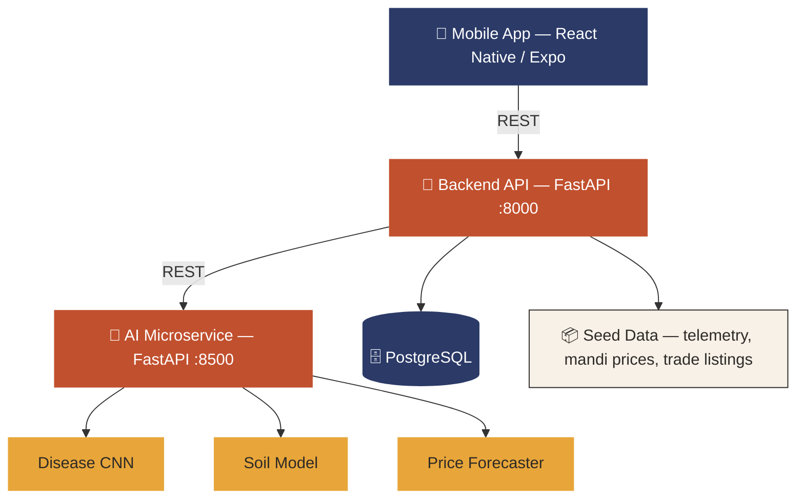

<div align="center">

<br/>
[](https://git.io/typing-svg)
 
<br/>


<br/>


<br/><br/>
 
<a href="#-the-problem"></a>
<a href="#-features"></a>
<a href="#-architecture"></a>
<a href="#-tech-stack"></a>
<a href="#-quick-start"></a>
<a href="#-project-structure"></a>
<a href="#-testing"></a>
<a href="#-roadmap"></a>
 
</div>
<br/>
<a name="-the-problem"></a>
## 🌾 The Problem
 
> A farmer in a small village photographs a diseased leaf with no one to ask. Weeks later, the same farmer sells a healthy harvest at a crashed price — because nobody told them the next village's mandi was paying 20% more.
 
Smallholder farmers live between two broken worlds:
 
| | |
|---|---|
| 🩺 **Field-level blindness** | Pest and disease outbreaks go undiagnosed until it's too late. Soil health decisions are guesswork. |
| 📉 **Post-harvest distress selling** | No visibility into regional mandi prices means farmers sell wherever's closest — rarely wherever's best. |
 
**Krishi Setu** exists to close that gap — one AI-powered platform, from the leaf to the ledger.
 
<br/>
<a name="-features"></a>
## ✨ Features
 
<table>
<tr>
<td width="33%" valign="top">
### 🔬 AI Disease Diagnosis
Photograph a leaf, get a diagnosis and treatment advisory in under 2 seconds — powered by a fine-tuned CNN served as an independent microservice.
 
</td>
<td width="33%" valign="top">
### 🌱 Soil & Irrigation Advisory
Submit soil telemetry (N-P-K, pH, moisture) and receive a health score with deficiency-specific, actionable recommendations.
 
</td>
<td width="33%" valign="top">
### 📈 14-Day Price Forecasting
Time-series forecasting over historical mandi data projects prices two weeks out — with confidence intervals, not false precision.
 
</td>
</tr>
<tr>
<td width="33%" valign="top">
### 🤝 Smart Buyer Matching
Ranks nearby mandis and buyers by predicted price and distance, turning a forecast into a concrete "sell here, sell now" recommendation.
 
</td>
<td width="33%" valign="top">
### 🚚 Logistics Provisioning
Connects a farmer's harvest schedule directly to transport and trade listings — closing the loop from diagnosis to doorstep.
 
</td>
<td width="33%" valign="top">
### 🌐 Offline-First Multilingual App
A React Native experience that caches locally and syncs when connectivity returns — built for rural networks, not boardroom Wi-Fi.
 
</td>
</tr>
</table>
<br/>
<a name="-architecture"></a>
## 🏗️ Architecture
 
The AI engine runs as its **own independently deployable microservice** — separate from the core backend — so diagnosis, forecasting, and advisory models can scale independently of farmer traffic and profile data.
 

 
<br/>
<a name="-tech-stack"></a>
## 🛠️ Tech Stack
 
<div align="center">
| Layer | Technology |
|---|---|
| **Mobile App** |   |
| **Backend API** |   |
| **AI Microservice** |     |
| **Database** |  |
| **Infra** |   |
 
</div>
<br/>
<a name="-project-structure"></a>
## 📂 Project Structure
 
```
agro-cloud-platform/
├── backend/              → FastAPI core API · auth · database · orchestration
├── ai-engine/             → Independent AI microservice (disease, soil, forecast models)
├── mobile-app/           → React Native (Expo) farmer-facing app
├── docs/                   → Architecture notes, diagrams, pitch material
├── seed-data/              → Mock telemetry, mandi prices, sample listings
└── docker-compose.yml      → One-command full-stack launch
```
 
<br/>
<a name="-quick-start"></a>
## 🚀 Quick Start
 
### Prerequisites
 


 
<br/>
<details>
<summary><b>🐳 Option 1 — Docker Compose (single command, recommended)</b></summary>
<br/>
```bash
docker-compose up --build
```
 
| Service | URL |
|---|---|
| Backend API docs | `http://localhost:8000/docs` |
| AI Microservice docs | `http://localhost:8500/docs` |
| PostgreSQL | `localhost:5432` |
 
</details>
<details>
<summary><b>⚡ Option 2 — Manual local launch (3 terminals, ~5 minutes)</b></summary>
<br/>
**Terminal 1 — AI & ML Engine (port 8500)**
```bash
cd agro-cloud-platform/ai-engine
python -m venv .venv && .venv\Scripts\Activate.ps1   # Windows
# source .venv/bin/activate                            # macOS/Linux
pip install -r requirements.txt
python -m uvicorn app.main:app --host 0.0.0.0 --port 8500
```
Verify → `http://localhost:8500/health`
 
**Terminal 2 — Backend API + Database Seed (port 8000)**
```bash
cd agro-cloud-platform/backend
python -m venv .venv && .venv\Scripts\Activate.ps1
pip install -r requirements.txt
python seed.py          # seeds telemetry, mandi prices, trade listings
python -m uvicorn app.main:app --host 0.0.0.0 --port 8000 --reload
```
Verify → `http://localhost:8000/docs`
 
**Terminal 3 — Mobile App (Expo Web preview, port 8082)**
```bash
cd agro-cloud-platform/mobile-app
npm install
npx expo export --platform web
python -m http.server 8082 --directory dist
```
Open → `http://localhost:8082`
 
</details>
<br/>
<a name="-testing"></a>
## 🧪 Testing
 
End-to-end integration tests verify the full pipeline — telemetry ingestion → AI diagnosis → yield forecasting → price forecasting → buyer matching → logistics provisioning:
 
```bash
cd agro-cloud-platform/backend
python test_e2e_integration.py
python test_farm_to_market_flow.py
```
 
Both should exit with status `0` and print full JSON responses.
 
<br/>
<a name="-roadmap"></a>
## 🗺️ Roadmap
 
- [x] Disease diagnosis microservice
- [x] Soil health advisory engine
- [x] 14-day mandi price forecasting
- [x] Smart buyer/mandi matching
- [ ] Voice input & text-to-speech advisory playback
- [ ] WhatsApp bot interface
- [ ] Live IoT soil sensor integration
- [ ] Multi-region, multi-crop scale-out
<br/>
## 🤝 Contributing
 
Contributions, issues, and feature requests are welcome.
 
```bash
# 1. Fork the repo
# 2. Create your feature branch
git checkout -b feature/amazing-feature
# 3. Commit your changes
git commit -m "Add amazing feature"
# 4. Push and open a Pull Request
git push origin feature/amazing-feature
```
 
<br/>
<div align="center">
### Built for Smart India Hackathon 2026
 

<br/><br/>
 

</div>